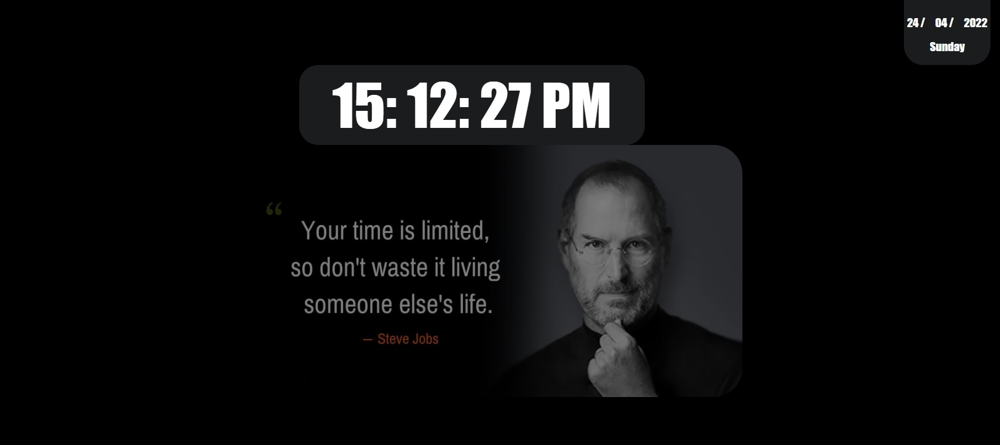

## Description
Project aims to create a digital clock.

## Problem Statement

- We are adding a new project to our portfolios. So you and your colleagues have started to work on the project.

## Project Skeleton 
```
006-Digital-Clock(folder)
|
|----readme.md         # Given to the students (Definition of the project)          
|----solution
        |----index.html  
        |----style.css   
        |----app.js
```
<p align="right">(<a href="#top">back to top</a>)</p>

## Expected Outcome



## Objective

Build a Digital Clock web site 

### At the end of the project, following topics are to be covered;

- HTML 

- CSS

- JS

<p align="right">(<a href="#top">back to top</a>)</p>

### At the end of the project, students will be able to;

- improve coding skills within HTML & CSS & JS

- use git commands (push, pull, commit, add etc.) and Github as Version Control System.

## Steps to Solution

- Step 1: Download or clone project repo on Github 

- Step 2: Create project folder for local public repo on your pc

- Step 3: Create a digital clock app

>>Part-1 HTML Structure

	- Creat structure of the HTML5
	- Give name of your project (title)
	- Create the main structur of the HTML

>>Part-2 CSS Structure

	- Set a background
	- Set container background color and margin
	- Define others color-size-padding etc...

>Part-3 JS Structure

	- Create code for digital clock

- Step 4: Push your application into your own public repo on Github

- Step 5: Deploy your application on Github template to showcase your app within your team.

<p align="right">(<a href="#top">back to top</a>)</p>

## Notes

- These methods can be used for getting information from a date object:

- getFullYear() => 	Get the year as a four digit number (yyyy)

- getMonth() 	=> 	Get the month as a number (0-11)

- getDate() 	=>	Get the day as a number (1-31)

- getHours() 	=>	Get the hour (0-23)

- getMinutes() 	=>	Get the minute (0-59)

- getSeconds() 	=>	Get the second (0-59)

- getDay() 		=>	Get the weekday as a number (0-6) 

- You can add additional functionalities to your clock.

<!-- CONTACT -->
## Contact

<a href="https://my-portfolio-page-resume.herokuapp.com/">

</a>

<a href="https://www.linkedin.com/in/enesunlu/">

</a>

<a href="https://twitter.com/Enes9103">

</a>

<a href="https://www.instagram.com/enesunlu0303/">

</a>

<a href="https://t.me/Enes9103">

</a>

<a href="mailto:enes9103@gmail.com">

</a>

Project Link: [https://github.com/enes9103](https://github.com/enes9103)
</p>
<p align="right">(<a href="#top">back to top</a>)</p>

<!-- SUPPORT -->
## Support

<p><a href="https://www.buymeacoffee.com/enes9103"> </a>

<center> ⌛ Happy Coding  ✍ </center>

<p align="right">(<a href="#top">back to top</a>)</p>
